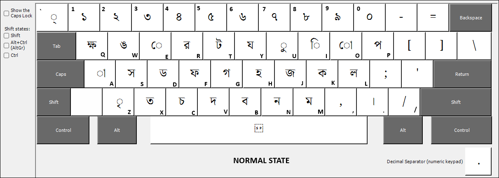
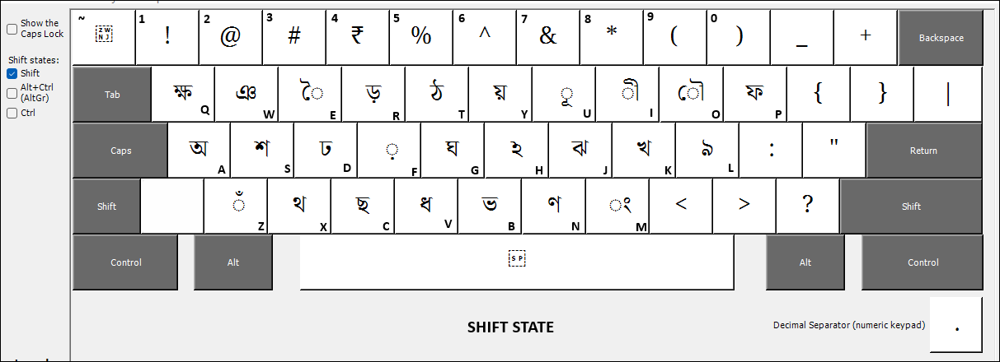
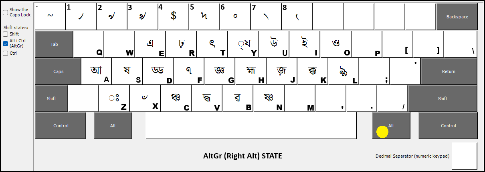
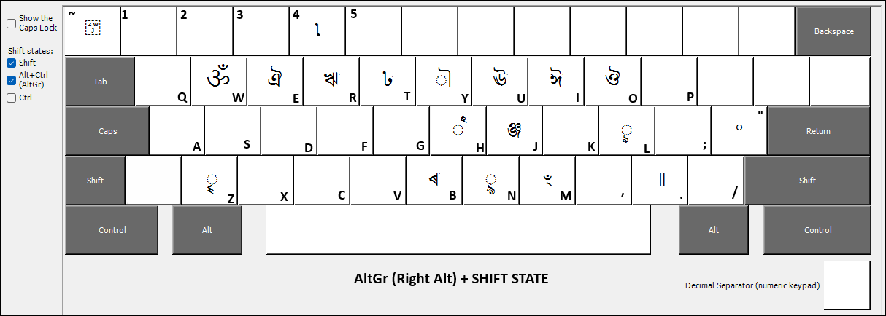
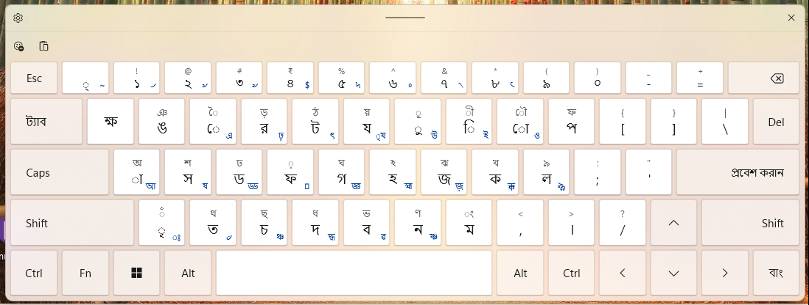
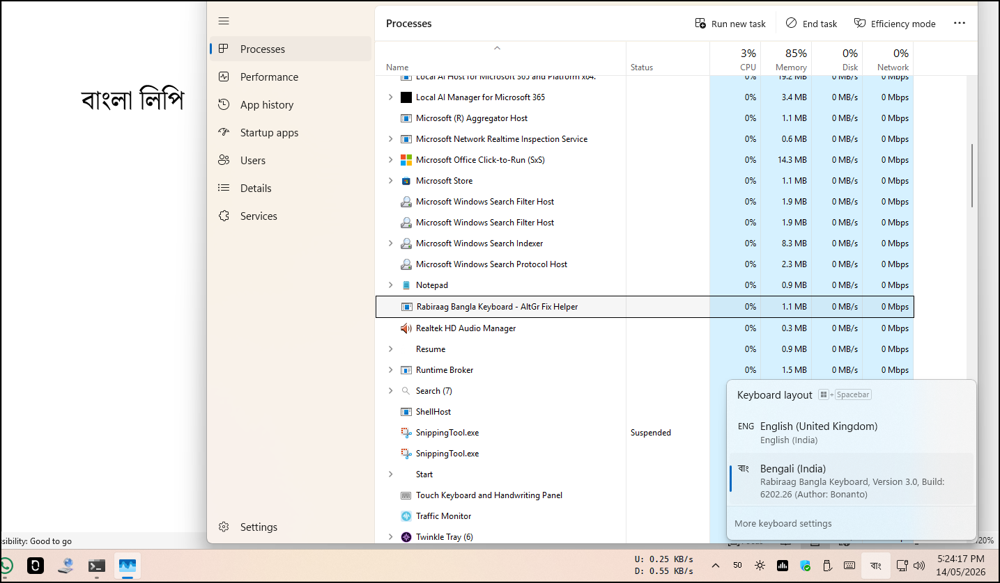
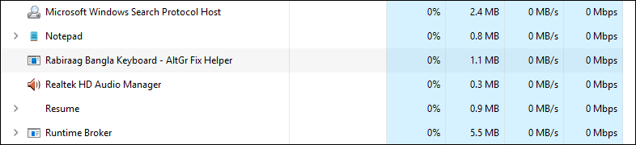
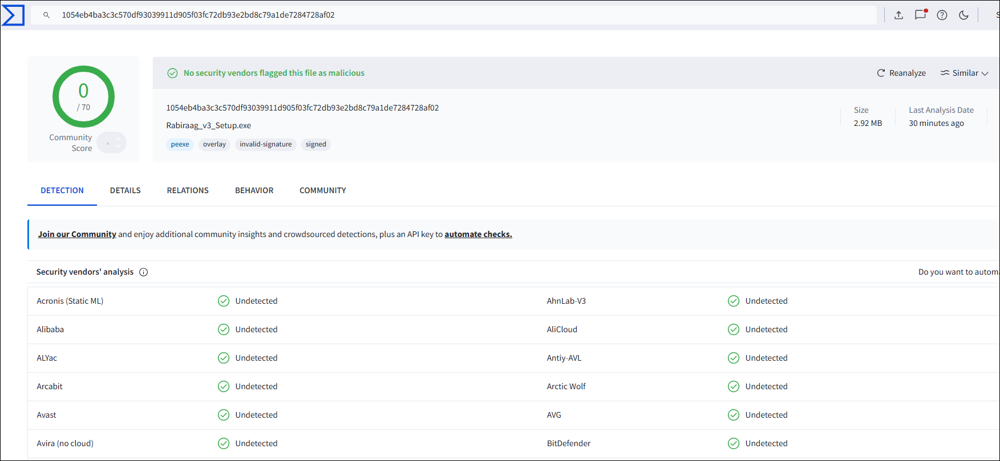

# Rabiraag (রবিরাগ) - Native Bengali Keyboard for Windows by Bonanto

[]()
[]()
[]()

**Rabiraag** is a highly optimized, native Bengali (Bangla) Inscript keyboard layout for Windows. Originally created in 2008 and meticulously tested over 17 years across every Windows version from XP to Windows 11, it provides a seamless, zero-bloat typing experience.

---

## 🌟 Why Rabiraag?

Unlike other Bengali typing tools, Rabiraag does **not** install a heavy third-party application. It simply installs a tiny, native Windows keyboard layout file (`.dll`) created using the official Microsoft Keyboard Layout Creator (MSKLC) and packaged with Inno Setup.

* **Zero Background Processes:** It does not run in the background or launch at startup, meaning it has **zero impact** on your PC's speed or performance.
* **Ultra Lightweight:** The layout file takes up less than 10KB of space, and the total installation is around 4.5 MB (including the Uninstaller).
* **Native Integration:** Fully supports modern Windows features, including the Windows 8/10/11 touch keypad and the On-Screen Keyboard.
* **Universal Compatibility:** Works flawlessly in any application that supports standard Unicode fonts.

---

## 📖 The Story Behind Rabiraag (রবিরাগ) Keyboard

সাল ২০০৮... Windows XP ছেড়ে Windows 7 এ এলাম। তখন একখানা Pentium 4 কম্পিউটার ছিল, আর তাতে চলত দুনিয়ার এক্সপেরিমেন্ট। হঠাৎই বাংলা লেখার প্রয়োজন পড়ল। আর বাংলা লেখার জন্য নেটিভ কোন ব্যবস্থা নেই। যা আছে, তা দিয়ে লেখা যায় না। আর আছে অভ্র কীবোর্ড। এখনো অভ্রের কোনো তুলনা নেই। অভ্রই প্রথম কম্পিউটারে বাংলা লেখার দিগন্ত উন্মোচিত করে দেয়, খুব সহজে। তা ইউনিকোড হোক, বা বিজয় (ANSI)।

যদিও অভ্র কীবোর্ড খুবই ভালো, কিন্তু তাতে ফোনেটিক টাইপিং-এ বহুক্ষেত্রেই আমার যে শব্দটা প্রয়োজন, দেখা যাচ্ছে সেটা পাচ্ছি না। গুগল কীবোর্ডের মত। বার বার বিভিন্ন কম্বিনেশন টাইপ করে করে দেখতে হচ্ছে। এছাড়া ইচ্ছেমত সমস্তরকম Characters লিখতে পারছি না, পুরনো বাংলায় ব্যবহৃত সমস্ত মার্কার, চিহ্ন – সেসব নেই, বা টাইপ করা বিশেষ ঝামেলার। এমনকি ভারতীয় মুদ্রার চিহ্নও খুঁজে পাওয়া মুশকিলের। — এছাড়াও, ইচ্ছেমত যুক্তাক্ষর লেখাও বিশেষ ঝামেলার। লিখতে যাচ্ছি এক, হয়ে যাচ্ছে আরেক, কখনা কখনো suggested list এর মধ্যে থেকে বেছে নিতে হচ্ছে, সেটা আরো সময়-নষ্টকারী কাজ। আর ফোনেটিক বাদে বাকি যা লেআউট আছে, তাতে সব Key গুলো ঠিকঠাক mapped না। মানে, ইংরিজি অক্ষরের সাথে বাংলা অক্ষরের মিল কম, কষ্ট করে মনে রাখতে হবে, কোন Key তে বাংলার কোন অক্ষর আসে।

সুতরাং আমার দরকার পড়ল এমন এক কী-বোর্ডের যেটা আমাকে সম্পূর্ণ নিয়ন্ত্রণ দেবে। আমার যেখানে যেমন অক্ষর, যুক্তাক্ষর, যতিচিহ্ন, সাধারণ চিহ্ন — মোটকথা যা ইচ্ছে হবে তাই ই লিখতে পারব। তার জন্য Phonetic এর বদলে Inscript ব্যবহার করতে হবে, যেখানে বাংলা হাতে লেখার মত করে লিখতে পারি, অর্থাৎ, প্রতিটা অক্ষর আর বানান, চিহ্ন, কার, ফলা – সব নিজে লেখা যায়। ইংরেজি থেকে বাংলা করে দেবে না সফটওয়্যার। এবারে, বাজারে অনেক Inscript কীবোর্ড আছে, কিন্তু তাতে অক্ষরগুলো উল্টোপাল্টা। S চাপলে “স” নাও আসতে পারে। — অনেককাল আগে একটা সফটওয়্যার ছিল, যে ঠিক এইভাবে, যেমন আমার প্রয়োজন, লিখতো। তার নাম Bangla Word. কিন্তু সেটা দিয়ে কেবল ওর মধ্যেই লেখা যেত। কারণ ওটা ইউনিকোড নয়, এবং ওর লেখা বাংলা আর কোথাও সাপোর্ট করে না। কেবল ANSI যে যে সফটওয়্যার ব্যবহার করে, তাতেই সাপোর্ট করে – যেমন – Photoshop, CorelDraw, এইসব। মাইক্রোসফট ওয়ার্ড, বা উইণ্ডোজের সিস্টেমে তা কাজ করে না।

তাই প্রথম কী-বোর্ড লে-আউটটা বানিয়েছিলাম Windows এর জন্য। এবং অবশ্যই নিজের ব্যবহারের জন্য। কারণ দ্রুত নির্ভুল বাংলা টাইপের জন্য আর কোনো সফটওয়্যার আমার প্রয়োজন মেটাতে পারেনি। অগত্যা সমাধান – নিজে একটা ব্যবস্থা করা। তৈরী হল Windows এর জন্য বাংলা কীবোর্ড লে-আউট – রবিরাগ। নাম রবীন্দ্রনাথের প্রতি ভালোবাসার কারণে। সেটা ২০০৮ সালেই MSKLC ব্যবহার করে।
 
এখন Windows 11-এ MSKLC ঠিক করে কাজ করেনা, তাই কীবোর্ড লে-আউটে কিছু রদবদল করে, আধুনিকতম এবং প্রাচীন বাংলার সমস্ত চিহ্ন, বিশেষ ক্যারেক্টারগুলো নতুন করে assign করলাম। এবং নতুন সেটআপ তৈরী করলাম। সাথে একটা হেল্পারও জুড়তে হল। মানে, Office 2024 এ দেখলাম AltGR (Right Alt) ও Left Alt এর মত শর্টকাট মডিফায়ারের কাজ করছে Office Macros এর জন্যে। এটা ঠিক করার উপায় হিসেবে একটা অতি ক্ষুদ্র Win32 C বাইনারি। 

রইল সকলের ব্যবহারের জন্য। টাইপিং কীভাবে করবেন, তার পদ্ধতি এখানে: [Typing_Guide.md](Documentation/Typing_Guide.md)

ধন্যবাদান্তে, ভালোবাসা সহ  
বনান্ত ❤️

কলকাতা, 
মে ১৪, ২০২৬। 

---

## 🚀 Installation

The latest release provides a professional standalone installer for a faster, one-step setup.

1. **Download the Release:** Download the latest Rabiraag_v3_Setup.exe from the [Releases](https://github.com/bonanto/rabiraag/releases) page
2. **Run the Setup:** Double-click the installer. If Windows SmartScreen displays an "Unknown Publisher" warning, click **"More info"** and then **"Run anyway."** (See Security & Verification below for a permanent fix).
3. **Finish:** The installer handles all registry settings, native DLL placement, and font installation automatically.
4. **Done:** It installs in a blink!

*(For full typing instructions, please see the [Typing_Guide.md](Documentation/Typing_Guide.md)).*

---

## ⌨️ How to Use

Once installed, Rabiraag behaves exactly like a standard Windows language pack.

* **Switching Languages:** Press **`Windows Key + Space`** (on Windows 8, 10, and 11) or **`Alt + Shift`** to instantly toggle between English and Bengali.
* **Touch Keyboard:** To enable the touch keyboard for easier typing on tablets or 2-in-1s, right-click your Taskbar > Toolbars (or Taskbar Settings) > Enable Touch Keyboard.

---

### Technical Note: The AltGr Helper (`rabiraag_helper.exe`)

**The Office Macro Conflict**
Modern versions of Microsoft Office (After Office 2021, especially Office 2024, and Office 365) have an aggressive macro handler that globally intercepts `Ctrl + Alt + Key` combinations. Because Windows treats the physical `AltGr` key ( or Right Alt) as a combination of `Left Ctrl + Right Alt`, Office incorrectly swallows these keystrokes. This prevents the 3rd layer (AltGr characters, e.g., ষ, ৴) and the 4th layer (AltGr+Shift characters, e.g., ঞ্জ, ॐ) from being typed in a custom Keyboard Layout. Office 2013-2019 is completely free from such issues; for those you can choose not to install the helpers; but it is recommended that you always install the Helpers so that Rabiraag keep working flawlessly in any application, completely free from any Key-combination conflict. 

While you could theoretically disable these shortcuts deep within Office settings, doing so applies globally and breaks standard shortcuts for every other language you type in (like using `AltGr+S` to split a document in English).

**The Helper Solution**
To seamlessly bypass this limitation, Rabiraag v3 includes an ultra-lightweight, pure Win32 C background helper. 
* **Smart Interception:** When you press `AltGr`, this helper safely intercepts the keystroke and injects the correct Unicode character directly into the document, completely bypassing Office's macro handler.
* **Layout-Specific Safeguard:** The helper strictly monitors your active keyboard. It **only** operates when the *Bangla (India)* or *Bangla (Bangladesh)* layout is active. If you switch to English (US) or any other language, the helper instantly ignores your keystrokes, ensuring your default Office macros continue to work.
* **Zero Bloat & Open Source:** The helper operates entirely offline, uses virtually zero system resources, and its complete source code (`rabiraag_helper.c`) is available in this repository to verify.

---

## 🔒 Security & Verification

To ensure that your download is authentic and has not been tampered with, you can verify its cryptographic SHA-256 hash.

* **File:** `Rabiraag_v3_Setup.exe`
* **Official SHA-256 Hash:** `1054eb4ba3c3c570df93039911d905f03fc72db93e2bd8c79a1de7284728af02
`

**How to verify on your machine:**
1. Open **Windows PowerShell**.
2. Run the following command (replacing the path with your actual download location):
   ```powershell
   Get-FileHash -Path "C:\Path\To\Your\Download\Rabiraag_v3_Setup.exe" -Algorithm SHA256
   ```
      Or, You can use 7zip to check CRC SHA > SHA 256 (From Context menu) to Produce file HASH. 

3. Ensure the output hash matches the official hash string provided above.

*(For absolute transparency, the included helper executables compiled into the setup have the following hashes:)*
* **Helper x64:** `SHA256: c154f615953c2c1e932e6cab668aec3a19d05687b1cbaee5bd0a95a0a017e252`
* **Helper x86:** `SHA256: ab37f540c3c02cc2ac10be9f1a7070d61b2e3d97353ef45436393aec939c3dbf`

### Bypassing SmartScreen (The .CER File) - Totally Optional
Because this installer is self-signed, Windows SmartScreen may display a blue "Unknown Publisher" warning. To permanently trust this installer and bypass the warning:
1. Download the `Bonanto_V3_Public.cer` file from **Verify** folder in this repository.
2. Double-click the `.cer` file and click **Install Certificate**.
3. Select **Local Machine** and click Next.
4. Choose **Place all certificates in the following store** and browse to **Trusted Root Certification Authorities**.
5. Click Next and Finish. You can now run `Rabiraag_v3_Setup.exe` without any warnings!

### Source Codes
The raw C source code (`.c`, `.h`, `.def`, and `.rc` files) used to build the keyboard `.dll` binaries is openly provided in the **`Sources\DLL Source Code`** directory. A Windows keyboard layout DLL is fundamentally just a static data table. By reviewing these uncompiled source files, developers and security researchers can easily verify every character mapping and confirm the absolute absence of malicious code, telemetry, or keyloggers.

---

## 📜 License

This project utilizes a **Split License** model to protect the final software while ensuring the underlying source code remains free and open. See the [LICENSE.md](LICENSE.md) for full legal details.

### License Summary:

* ✅ **Free to use** - Personal, educational, and professional (commercial) use of the official Rabiraag keyboard is permitted.
* ✅ **Redistribution** - You are free to redistribute the original, unmodified `Rabiraag_v3_Setup.exe` installer.
* ✅ **Source Code Modification (GPL License)** - The raw source code files (`.klc`, `.c`, `.h`, etc.) located in the `Source Code` folder are open-source under the GNU General Public License. You are completely free to copy, modify, and use these files to build your own custom keyboard layouts, provided that **your derivative project is also released open-source under the GPL**, and you must credit the original author.
* ❌ **No Proprietary Derivatives** - You may not modify the source code and release the resulting keyboard layout as closed-source or commercial software.
* ❌ **No Modification of Compiled Binaries** - You may not modify, adapt, or reverse-engineer the official compiled binaries (`.dll`), the Inno setup codes (`.iss`), or the official installer executable.
* ❌ **Not for Sale** - Selling, renting, leasing, or commercially exploiting, or bundling the software with any paid software is strictly prohibited.
* ⚠️ **Font Licensing:** The installer bundles Google Noto Fonts. These fonts remain the property of their respective creators and are legally distributed under the SIL Open Font License, Version 1.1 (OFL).
* ⚠️ **Credits** - Original copyright notices and author credit must be maintained.

---

## 👨‍💻 Author

**Shyamal Kumar Biswas (Bonanto) / Habitat Whisper**
Tested and refined since 2008.

*(Looking for the Linux version? Check out [Saswati Keyboard](https://github.com/bonanto/saswati-keyboard) for Linux systems).*

---

## 🛠️ How to Build 

To build the custom DLL files from the KLC script, you need `kbdutool.exe`. The official MSKLC v1.4 application from Microsoft often crashes on Windows 11 when attempting to build libraries. To bypass this, we extract the required compiler directly from the MSKLC installer.

### Part 1: Compiling the DLLs

**Step 1: Extract MSKLC**
1. Download the `MSKLC.exe` installer from Microsoft.
2. Right-click the downloaded `MSKLC.exe` file and use **7-Zip** to extract its contents to a folder. 
3. Inside that extracted folder, you will find the `MSKLC.msi` file.
4. Open Command Prompt as Administrator and run the following command to extract the MSI contents into a new folder named `extracted` on your C drive (replace the source path with your actual `.msi` location):
   ```cmd
   msiexec /a "C:\Path\To\Extracted\MSKLC.msi" /qb TARGETDIR="C:\extracted"
   ```

**Step 2: Prepare the Workspace**
1. Navigate to the extracted tools folder: `C:\extracted\bin\i386`
2. Copy your KLC script (e.g., `rabiraag.klc` or `example.klc`) into this `i386` folder. *(Note: Ensure your `.klc` file is encoded in **UTF-16 LE**).*
3. Create two new folders inside `C:\extracted` to store your outputs:
   * `C:\extracted\x86`
   * `C:\extracted\amd64`

**Step 3: Compile the 32-bit (x86) DLL**
Open Command Prompt, navigate to the compiler directory, and build the 32-bit file:
```cmd
cd /d "C:\extracted\bin\i386"
kbdutool -u -x rabiraag.klc
move /y "rabiraag.dll" "C:\extracted\x86\rabiraag.dll"
```

**Step 4: Compile the 64-bit (AMD64) DLL**
In the same Command Prompt window, build the 64-bit file:
```cmd
kbdutool -u -m rabiraag.klc
move /y "rabiraag.dll" "C:\extracted\amd64\rabiraag.dll"
```

### Part 2: Creating the Installer

While MSKLC can generate installers, they are outdated and unreliable on Windows 11. We use **Inno Setup** (Free and Open Source) to create a modern executable.

1. Create a dedicated compiling folder, e.g., `C:\Compile`.
2. Move your generated `x86` and `amd64` folders (containing your newly compiled `.dll` files) into `C:\Compile`.
3. Copy all necessary installer assets into `C:\Compile`. This includes your License Agreement (`license.rtf`), installer images (`keyboard.bmp`, banner images), and your `.ico` file.
4. Open Inno Setup and write your Inno Setup compiling codes (`.iss`). Save the code to the `C:\Compile` folder and name it `compile.iss`.
5. Make sure the parent folder for your script is `C:\Compile` so it can find your DLLs and assets.
6. Press **Ctrl+F9** to build. 
7. Once completed, a new `Output` folder will appear in `C:\Compile` containing your final Setup executable.

---

## 📸 Keyboard Layouts

Rabiraag uses a 4-layer system to provide access to all Bengali characters, conjuncts, and symbols. 

*(For a complete, text-based breakdown of every key and its Unicode value, please see the [KEY_MAPPINGS.md](Documentation/KEY_MAPPINGS.md) file).*

### 1. Normal Layer (No Modifiers)


### 2. Shift Layer


### 3. AltGr Layer (Right Alt)


### 4. AltGr + Shift Layer


### 5. Touch Keyboard Support
Rabiraag is fully compatible with the Windows touch keyboard


### 6. The AltGr Helper in Task Manager - and Active Rabiraag Keyboard in Taskbar
Helper runs silently in the background, consuming virtually zero resources.


### 7. Helper runs silently in the background, consuming virtually zero resources.


### 8. VirusTotal Result for V3 Release EXE file. Check Hash there.


